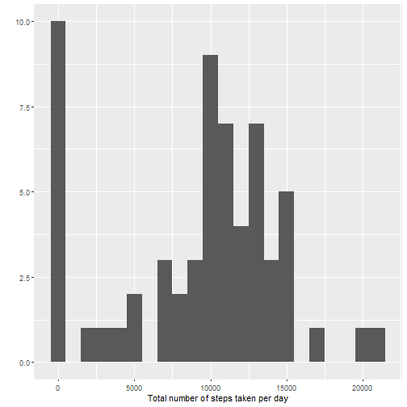
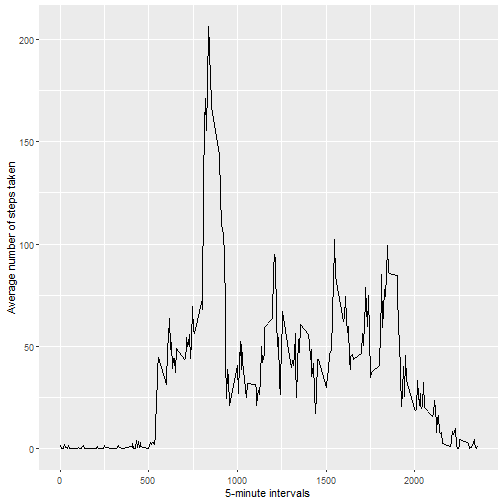
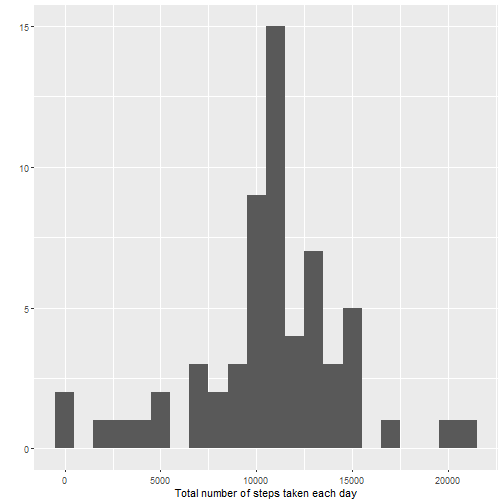
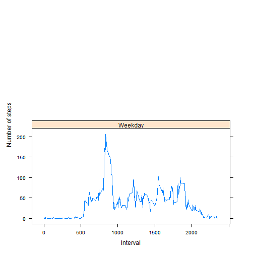

## Instructions
1.Code for reading in the dataset and/or processing the data
2.Histogram of the total number of steps taken each day
3.Mean and median number of steps taken each day
4.Time series plot of the average number of steps taken
5.The 5-minute interval that, on average, contains the maximum number of steps
6.Code to describe and show a strategy for imputing missing data
7.Histogram of the total number of steps taken each day after missing values are imputed
8.Panel plot comparing the average number of steps taken per 5-minute interval across weekdays and weekends
9.All of the R code needed to reproduce the results (numbers, plots, etc.) in the report

## (1.) Loading and preprocessing the data 

```r
setwd("C:/R-Projects/RepData_PeerAssessment1")
act <- read.csv("activity.csv")
```
Basic Information about the dataset

```r
dim(act)
```

```
## [1] 17568     3
```

```r
head(act)
```

```
##   steps       date interval
## 1    NA 2012-10-01        0
## 2    NA 2012-10-01        5
## 3    NA 2012-10-01       10
## 4    NA 2012-10-01       15
## 5    NA 2012-10-01       20
## 6    NA 2012-10-01       25
```

```r
names(act)
```

```
## [1] "steps"    "date"     "interval"
```

```r
str(act)
```

```
## 'data.frame':	17568 obs. of  3 variables:
##  $ steps   : int  NA NA NA NA NA NA NA NA NA NA ...
##  $ date    : chr  "2012-10-01" "2012-10-01" "2012-10-01" "2012-10-01" ...
##  $ interval: int  0 5 10 15 20 25 30 35 40 45 ...
```
## (2.) (3.) What is mean total number of steps taken per day?

```r
# histogram
library(ggplot2)

total.steps <- tapply(act$steps, act$date, FUN = sum, na.rm = TRUE)
qplot(total.steps, binwidth = 1000, xlab = "Total number of steps taken per day")
```



```r
mean(total.steps, na.rm=TRUE)
```

```
## [1] 9354.23
```

```r
median(total.steps, na.rm=TRUE)
```

```
## [1] 10395
```
## (4.) (5.) What is the average daily activity pattern?

```r
library(ggplot2)
averages <- aggregate(steps ~ interval, data = act, mean, na.rm = TRUE)
ggplot(data = averages, aes(x = interval, y = steps)) + geom_line() + xlab("5-minute intervals") +
    ylab("Average number of steps taken")
```




## (6.) (7.) Imputing missing values

```r
missing <- is.na(act$steps)
table(missing)
```

```
## missing
## FALSE  TRUE 
## 15264  2304
```

```r
getAvgStepsPerInterval <- function(interval){
    averages[averages$interval==interval,]$steps
}

filled.data <- act
for(i in 1:nrow(filled.data)){
    if(is.na(filled.data[i, ]$steps)){
        filled.data[i, ]$steps <- getAvgStepsPerInterval(filled.data[i, ]$interval)
    }
}
```


```r
total.steps <- tapply(filled.data$steps, filled.data$date, FUN = sum)
qplot(total.steps, binwidth = 1000, xlab="Total number of steps taken each day")
```



```r
mean(total.steps)
```

```
## [1] 10766.19
```

```r
median(total.steps)
```

```
## [1] 10766.19
```
## (8.) (9.) Are there differences in activity patterns between weekdays and weekends?


```r
filled.data$date <- as.Date(strptime(filled.data$date, format="%Y-%m-%d"))
filled.data$day <- weekdays(filled.data$date)
for (i in 1:nrow(filled.data)) {
    if (filled.data[i, ]$day %in% c("Saturday","Sunday")) {
        filled.data[i, ]$day<-"Weekend"
    }
    else{
        filled.data[i, ]$day<-"Weekday"
    }
}
stepsByDay <- aggregate(filled.data$steps ~ filled.data$interval + filled.data$day, filled.data, mean)
```


```r
names(stepsByDay) <- c("interval", "day", "steps")
library(lattice)

xyplot(steps ~ interval | day, stepsByDay, type = "l", layout = c(1, 2), 
    xlab = "Interval", ylab = "Number of steps")
```



